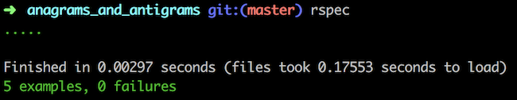

# anagrams_and_antigrams

#### by Ron Craig (ron.craig@comcast.net), updated 2/9/2018
### GitHub repository: https://github.com/r-craig73/anagrams_and_antigrams

## Description
### Create a ruby method and use BDD to determine if two different words are anagrams or not (antigrams).

## Specification
1. Checks if the input word (word1) does not contain empty spaces or punctuations.
2. Checks if the two words are anagrams.
3. Checks if the two words have different cases ("Ruby" or "ruby").
4. Checks if the input word (word1) contains vowels.
5. Checks if the input word (word1) does not match the number of letters.
6. Checks if the input word does not match the number of letters and return the matching letters (not working).

### Rspec results

## Known Bugs
### Sixth specification is not working.

## Setup/Installation Requirements
### Clone repository.
### Install Ruby and Gems
* `$ gem install rspec`
* `$ gem install pry`
* `$ bundle install`

### Run rspec in the terminal's home directory path
* `anagrams_antigrams $ rspec`

## Technologies Used
* Ruby
* Ruby script
* Ruby Gems

## Support and contact details
_Please contact ron.craig@comcast.net with questions._

## MIT License
